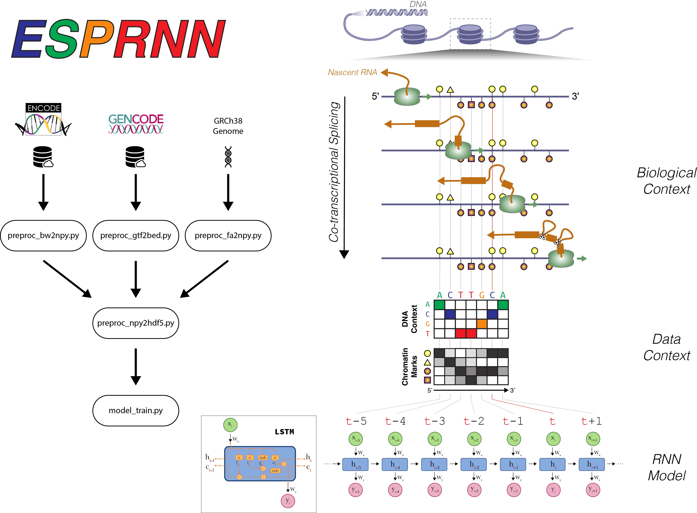

# ESPRNN: Epigenome-based Splicing Prediction using Recurrent Neural Network

## Dependencies:

### Python module
* numpy http://www.numpy.org/
* scipy
* scikit-learn http://scikit-learn.org/stable/
* biopython http://biopython.org/
* pandas
* tensorflow (recommends v2.0 or above, for v1.x, keras is required)
* h5py
* pybigwig
* pybedtools
* (Optional) jupyter
* (Optional) pysam
* (Optional) Theano http://deeplearning.net/software/theano/
* (Optional) Keras https://github.com/fchollet/keras
* (Optional) matplotlib http://matplotlib.org/
* (Optional) seaborn

Note: At the time of writing (12/27/2019), the following versions of python modules were tested and confirmed working:
* biopython                 1.74
* cudatoolkit               10.1.243
* cudnn                     7.6.5
* h5py                      2.10.0
* numpy                     1.18.0
* pandas                    0.25.3
* pybedtools                0.8.0
* pybigwig                  0.3.17
* pysam                     0.15.3
* python                    3.6.9
* scikit-learn              0.22
* scipy                     1.4.1
* seaborn                   0.9.0
* tf-nightly-gpu            2.1.0.dev20191224

### Standalone
* RNA-STAR v2.7.3a
* HTSeq v0.9.1
* bedtools v2.27.1
* samtools v1.9

## Recommended Usage Examples

### STEP 1: create a conda environment

```
conda create -n esprnn python=3.6 tensorflow-gpu scikit-learn biopython pybigwig pybedtools pandas seaborn jupyter
conda activate espenn
```

### STEP 2: download data

* genome: we used something like /genomes/Homo_sapiens/NCBI/GRCh38/Sequence/WholeGenomeFasta/genome.fa
* annotation: we used something like gencode.v24.annotation.gtf
* see supplementary table 1 for ENCODE reference epigenome accession

### STEP 3: align RNA-seq fastq files

we used RNA-STAR v2.7.3a with the following command
```
STAR --runThreadN 12 --genomeDir {path_to_star_index} --outFilterType BySJout --outFilterMultimapNmax 20 --alignSJoverhangMin 8 --alignSJDBoverhangMin 1 --outFilterMismatchNmax 999 --outFilterMismatchNoverReadLmax 0.04 --alignIntronMin 20 --alignIntronMax 1000000 --alignMatesGapMax 1000000 --readFilesCommand zcat --readFilesIn {path_to_fastq} --outFileNamePrefix {prefix}
```

### STEP 4: make EXON annotation (based on this file, make 3' acceptor and 5' donor splice sites BED files)

```
python preproc_gtf2bed.py gencode.v24.annotation.gtf gencode.v24.annotation.esprnn-exon.bed
```

### STEP 5-1: calculate FPKM

```
htseq-count -f bam -t exon --idattr=exon_id --additional-attr=gene_name --nonunique all {bam_file} gencode.v24.annotation.gtf > exon-count_XXX.tsv
python preproc_calcExonFPKM.py -s {sample_name} -o avgFPKM_XXX.tsv -p {path_to_count_file} -l {gene_length_file}
```

### STEP 5-2: calculate PSI

```
calcPSI.sh {path_to_sam} {prefix_to_sam} {exon_annotation}
```

### STEP 6: make genome input

```
bedtools getfasta -fi genome.fa -bed gencode.v24.annotation.esprnn-exon.3acc400span.bed -s -name -fo hg38_DNA_3acc_400span.fa
bedtools getfasta -fi genome.fa -bed gencode.v24.annotation.esprnn-exon.5don400span.bed -s -name -fo hg38_DNA_5don_400span.fa
python preproc_fa2npy.py -i hg38_DNA_3acc_400span.fa -o XXX_DNA_3acc_500span.npy
python preproc_fa2npy.py -i hg38_DNA_5don_400span.fa -o XXX_DNA_5don_500span.npy
```
Note: NT Mapping: {'A': 0, 'C': 1, 'T': 2, 'G': 3}

### STEP 7: make epigenetic feature input

```
python preproc_bw2npy.py --bigwig {path_to_bigwig_file} --bed gencode.v24.annotation.esprnn-exon.3acc500span.bed --prefix XXX_3acc_input.npy
python preproc_bw2npy.py --bigwig {path_to_bigwig_file} --bed gencode.v24.annotation.esprnn-exon.5don500span.bed --prefix XXX_5don_input.npy
```

### STEP 8: make HDF5 input

```
python preproc_npy2hdf5.py --path {path_to_npy_file} --x1 "hg38_DNA_3acc_400span.npy,XXX_DNase_3acc.npy,XXX_H3K27ac_3acc.npy,XXX_H3K27me3_3acc.npy,XXX_H3K36me3_3acc.npy,XXX_H3K4me1_3acc.npy,XXX_H3K4me3_3acc.npy,XXX_H3K9me3_3acc.npy" --x2 "hg38_DNA_5don_400span.npy,XXX_DNase_5don.npy,XXX_H3K27ac_5don.npy,XXX_H3K27me3_5don.npy,XXX_H3K36me3_5don.npy,XXX_H3K4me1_5don.npy,XXX_H3K4me3_5don.npy,XXX_H3K9me3_5don.npy" --y "XXX_PSI_binary.npy" --span 400 --prefix XXX_input
```

### STEP 9: training

```
python model_train.py --prefix XXX_LSTM_200span --input XXX_input.hdf5 --model LSTM --span 400 --epoch 20 --batchsize 100
```
